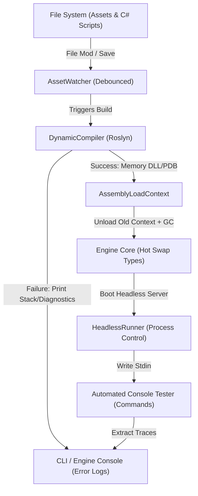

# ⚔️ Implementing the Dev-Tool Pipeline in a C# Game Engine

This document details how to take the automated development, hot-reloading, packaging, version-bumping, and headless testing pipeline from the Minecraft BDS tools (`watch.ps1`, `pack.ps1`, `deploy.ps1`, `test.ps1`, `release.ps1`) and implement it within a C# game engine environment (such as Unity, Godot with C#, or a custom Monogame/FNA/Raylib engine).

---

## 🗺️ Conceptual Mapping: Minecraft BDS vs C# Game Engine

Here is how the Aethelgrad tools translate into C# Engine components:

| Minecraft BDS Pipeline Tool | C# Engine Equivalent Component | Core Mechanism / API |
| :--- | :--- | :--- |
| **`watch.ps1`** (File watcher + sync) | **`AssetWatcher & DynamicCompiler`** | `System.IO.FileSystemWatcher` + Microsoft.CodeAnalysis.CSharp (Roslyn) |
| **`deploy.ps1`** (Dev folder sync) | **`AssemblyLoadContext Hot-Reloader`** | Loading memory-compiled DLLs into collectible contexts |
| **`pack.ps1`** (Zip packaging) | **`AssetPackager`** | `System.IO.Compression.ZipArchive` packing raw assets into `.pak` |
| **`release.ps1`** (Auto-bump + publish) | **`ReleaseManager`** | Base-10 odometer version bump + manifest writer |
| **`test.ps1`** (Process lifecycle management) | **`HeadlessServerRunner`** | `System.Diagnostics.Process` with I/O Stream redirection |

---

## 🏗️ System Architecture

The following diagram illustrates the lifecycle of the hot-reload compilation and runner pipeline:



---

## 🛠️ Code Implementations

Below are the production-grade, thread-safe C# classes required to construct this pipeline.

### 1. The Dev Watcher & Debouncer (`EngineWatcher.cs`)
This module monitors directories for file modifications. When changes are made, it debounces the events (similar to the `$DEBOUNCE_MS` check in `watch.ps1`) to avoid compiling multiple times during rapid saves.

```csharp
using System;
using System.IO;
using System.Threading;

public class EngineWatcher : IDisposable
{
    private readonly FileSystemWatcher _watcher;
    private readonly Timer _debounceTimer;
    private readonly Action _onChangedCallback;
    private readonly int _debounceMs;
    private int _isPending = 0;

    public EngineWatcher(string watchPath, string filter, Action onChangedCallback, int debounceMs = 800)
    {
        _onChangedCallback = onChangedCallback;
        _debounceMs = debounceMs;
        _debounceTimer = new Timer(DebounceComplete, null, Timeout.Infinite, Timeout.Infinite);

        _watcher = new FileSystemWatcher(watchPath, filter)
        {
            IncludeSubdirectories = true,
            NotifyFilter = NotifyFilters.LastWrite | NotifyFilters.FileName | NotifyFilters.DirectoryName
        };

        _watcher.Changed += OnFileChanged;
        _watcher.Created += OnFileChanged;
        _watcher.Deleted += OnFileChanged;
        _watcher.Renamed += OnFileChanged;
    }

    public void Start() => _watcher.EnableRaisingEvents = true;
    public void Stop() => _watcher.EnableRaisingEvents = false;

    private void OnFileChanged(object sender, FileSystemEventArgs e)
    {
        // Thread-safe flag to ensure we handle the active debounce window
        Interlocked.Exchange(ref _isPending, 1);
        _debounceTimer.Change(_debounceMs, Timeout.Infinite);
    }

    private void DebounceComplete(object state)
    {
        if (Interlocked.CompareExchange(ref _isPending, 0, 1) == 1)
        {
            _onChangedCallback?.Invoke();
        }
    }

    public void Dispose()
    {
        _watcher.Dispose();
        _debounceTimer.Dispose();
    }
}
```

---

### 2. Roslyn Dynamic Compiler (`DynamicCompiler.cs`)
This compiler takes source directories, runs C# Roslyn compilation entirely in memory, and returns the DLL bytes.

```csharp
using System;
using System.IO;
using System.Linq;
using System.Reflection;
using Microsoft.CodeAnalysis;
using Microsoft.CodeAnalysis.CSharp;

public static class DynamicCompiler
{
    public static byte[] Compile(string sourceDir, string assemblyName, out Diagnostic[] diagnostics)
    {
        var syntaxTrees = Directory.GetFiles(sourceDir, "*.cs", SearchOption.AllDirectories)
            .Select(filePath => CSharpSyntaxTree.ParseText(File.ReadAllText(filePath)))
            .ToArray();

        // Reference essential assemblies (equivalent to MC's script references)
        var references = new MetadataReference[]
        {
            MetadataReference.CreateFromFile(typeof(object).Assembly.Location),
            MetadataReference.CreateFromFile(typeof(Console).Assembly.Location),
            MetadataReference.CreateFromFile(Assembly.Load(new AssemblyName("System.Runtime")).Location)
        };

        var compilation = CSharpCompilation.Create(
            assemblyName,
            syntaxTrees,
            references,
            new CSharpCompilationOptions(OutputKind.DynamicallyLinkedLibrary, 
                optimizationLevel: OptimizationLevel.Debug, 
                allowUnsafe: true)
        );

        using var ms = new MemoryStream();
        var result = compilation.Emit(ms);

        diagnostics = result.Diagnostics.Where(d => d.Severity == DiagnosticSeverity.Error).ToArray();

        if (!result.Success)
        {
            return null;
        }

        return ms.ToArray();
    }
}
```

---

### 3. Assembly Load Context Hot-Reloader (`AssemblyReloader.cs`)
This module leverages `.NET Core`'s collectible assembly contexts to dynamically reload code into the game loop on the fly without having to terminate the editor or game runtime.

```csharp
using System;
using System.IO;
using System.Reflection;
using System.Runtime.Loader;

public class CollectibleAssemblyLoadContext : AssemblyLoadContext
{
    public CollectibleAssemblyLoadContext() : base(isCollectible: true) { }

    protected override Assembly Load(AssemblyName assemblyName)
    {
        // Resolve references via default system context first
        return null;
    }
}

public class HotReloader
{
    private CollectibleAssemblyLoadContext _context;
    private Assembly _loadedAssembly;

    public Assembly LoadedAssembly => _loadedAssembly;

    public void Load(byte[] dllBytes)
    {
        Unload();

        _context = new CollectibleAssemblyLoadContext();
        using var stream = new MemoryStream(dllBytes);
        _loadedAssembly = _context.LoadFromStream(stream);
    }

    public void Unload()
    {
        if (_context == null) return;

        _context.Unload();
        _context = null;
        _loadedAssembly = null;

        // Force GC cleanup of the unloaded assemblies
        for (int i = 0; i < 10 && _context != null; i++)
        {
            GC.Collect();
            GC.WaitForPendingFinalizers();
        }
    }
}
```

---

### 4. Asset Packager & Odometer Version Bumper (`AssetPackager.cs`)
This compiles raw game assets into a compressed structure, matching `pack.ps1` and `release.ps1`. It features a base-10 odometer system for minor/patch semantic increments.

```csharp
using System;
using System.IO;
using System.IO.Compression;
using System.Text.Json;
using System.Text.Json.Nodes;

public class AssetPackager
{
    public static void PackAssets(string sourceDirectory, string outputZipPath)
    {
        if (File.Exists(outputZipPath))
        {
            File.Delete(outputZipPath);
        }
        ZipFile.CreateFromDirectory(sourceDirectory, outputZipPath, CompressionLevel.Optimal, false);
    }

    public static string AutoBumpVersion(string manifestJsonPath)
    {
        if (!File.Exists(manifestJsonPath)) return "0.0.0";

        var manifestText = File.ReadAllText(manifestJsonPath);
        var json = JsonNode.Parse(manifestText);
        var versionNode = json["version"]?.AsArray();

        if (versionNode == null || versionNode.Count < 3) return "0.0.0";

        int major = (int)versionNode[0];
        int minor = (int)versionNode[1];
        int patch = (int)versionNode[2];

        // Base-10 Odometer roll-over logic (matches release.ps1)
        if (patch < 9)
        {
            patch++;
        }
        else if (minor < 9)
        {
            patch = 0;
            minor++;
        }
        else
        {
            patch = 0;
            minor = 0;
            major++;
        }

        // Write values back into Node
        versionNode[0] = major;
        versionNode[1] = minor;
        versionNode[2] = patch;

        var options = new JsonSerializerOptions { WriteIndented = true };
        File.WriteAllText(manifestJsonPath, json.ToJsonString(options));

        return $"{major}.{minor}.{patch}";
    }
}
```

---

### 5. Dedicated Server Headless Test Runner (`HeadlessRunner.cs`)
An equivalent of `test.ps1`. Launches the server process, pipes the input stream for headless testing, runs console-driven commands, and extracts script failure stack traces.

```csharp
using System;
using System.Diagnostics;
using System.IO;

public class HeadlessRunner
{
    private Process _serverProcess;

    public void StartServer(string exePath, string workingDir)
    {
        _serverProcess = new Process
        {
            StartInfo = new ProcessStartInfo
            {
                FileName = exePath,
                WorkingDirectory = workingDir,
                Arguments = "--headless --console",
                RedirectStandardInput = true,
                RedirectStandardOutput = true,
                RedirectStandardError = true,
                UseShellExecute = false,
                CreateNoWindow = true
            }
        };

        _serverProcess.OutputDataReceived += (sender, args) =>
        {
            if (string.IsNullOrEmpty(args.Data)) return;

            // Highlight errors or stack traces (Matches trace extraction)
            if (args.Data.Contains("Exception") || args.Data.Contains("Error"))
            {
                Console.ForegroundColor = ConsoleColor.Red;
                Console.WriteLine($"[CRASH TRACE] {args.Data}");
                Console.ResetColor();
            }
            else
            {
                Console.WriteLine($"[SERVER] {args.Data}");
            }
        };

        _serverProcess.Start();
        _serverProcess.BeginOutputReadLine();
        _serverProcess.BeginErrorReadLine();
    }

    public void SendCommand(string command)
    {
        if (_serverProcess != null && !_serverProcess.HasExited)
        {
            _serverProcess.StandardInput.WriteLine(command);
        }
    }

    public void StopServer()
    {
        if (_serverProcess != null && !_serverProcess.HasExited)
        {
            SendCommand("stop");
            _serverProcess.WaitForExit(5000);
            if (!_serverProcess.HasExited)
            {
                _serverProcess.Kill();
            }
            _serverProcess.Dispose();
            _serverProcess = null;
        }
    }
}
```

---

## 🎨 Walkthrough: Integrating Modules Into the Game Engine Loop

1. **Step 1: Initialize File Watcher**
   ```csharp
   var sourcePath = @"C:\MyGameProject\Assets";
   var watcher = new EngineWatcher(sourcePath, "*.cs", () => {
       Console.WriteLine("✨ Changes detected! Compiling...");
       TriggerHotReload();
   });
   watcher.Start();
   ```

2. **Step 2: Trigger Compile & Load**
   ```csharp
   void TriggerHotReload() {
       byte[] assemblyBytes = DynamicCompiler.Compile(
           @"C:\MyGameProject\Assets\Scripts", 
           "GameScripts", 
           out var errors
       );

       if (assemblyBytes == null) {
           foreach(var err in errors) {
               Console.WriteLine($"❌ Error: {err.GetMessage()}");
           }
           return;
       }

       // Swaps DLLs cleanly at runtime!
       var reloader = new HotReloader();
       reloader.Load(assemblyBytes);
   }
   ```

3. **Step 3: Run Diagnostics & Stdin Pipeline**
   ```csharp
   var runner = new HeadlessRunner();
   runner.StartServer(@"C:\MyGameProject\Bin\Server.exe", @"C:\MyGameProject\Bin");

   // Execute mock tests headless (Matches scriptevent command tests)
   runner.SendCommand("test_cmd listwarps");
   runner.SendCommand("test_cmd calc 5 + 5");

   runner.StopServer();
   ```

> [!NOTE]
> Ensure that any game scripts dynamically reloaded via `CollectibleAssemblyLoadContext` do not leave trailing references (e.g., active event subscriptions or static dictionary references inside the host engine). Otherwise, the context will not be garbage collected and memory usage will leak.

> [!IMPORTANT]
> To compile with Roslyn dynamically, you must add the `Microsoft.CodeAnalysis.CSharp` package to your project. Use NuGet to add:
> ```bash
> dotnet add package Microsoft.CodeAnalysis.CSharp
> ```
