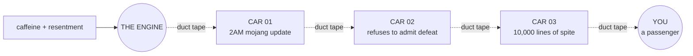

# ☩ THE OFFICIAL AETHELLIB MANIFESTO

*(Dictated by Wladyslaw)*

---

> AethelLib is not a service. It is not a product. It is a reaction.

I do not update this framework because I love you. I do not update it because I want your GitHub stars or your Discord pings.

I update it because Mojang pushed an update at 2 AM and broke my economy system for the fifth time.

I update it because I refuse to let a block game defeat me.

I update it because the alternative is admitting defeat, and I would rather write 10,000 lines of JavaScript than admit defeat.

You are not customers. You are passengers on a train I am building out of spite. The tracks are held together by duct tape. The engine runs on caffeine and resentment.

**`NOT A SERVICE · NOT A PRODUCT · A REACTION`**

### fig. 1 — propulsion schematic *(not to scale)*

*structural integrity of tracks not guaranteed, implied, or audited*

> You are not customers. You are passengers on a train I am building out of spite.

Enjoy the ride. Or don't. I don't care.

*— The Maintainer, who is not your friend, but will fix your bug anyway because it annoys them personally*
