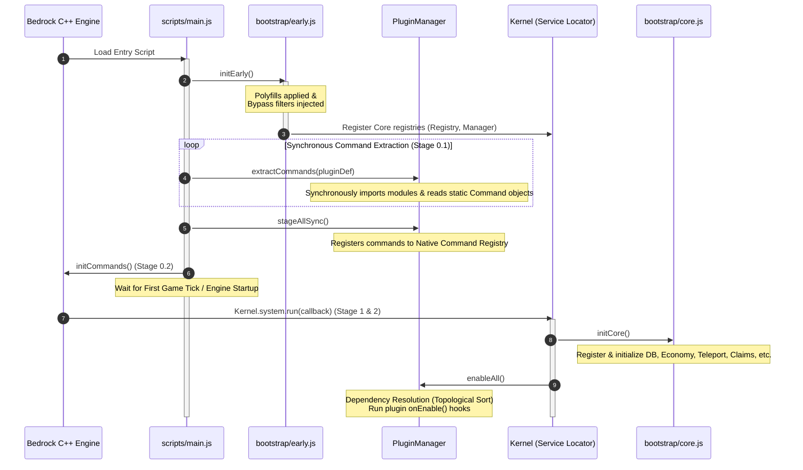

# Aegis Infrastructure Architecture & Core Design Document

This document provides a comprehensive design specification of the **AethelLib** bootstrapping pipeline, the **Kernel** service locator, the modular **Plugin System**, and the underlying **Safety Containment Protocols** used to prevent engine crashes and resource leaks. 

---

## 1. Bootstrapping Pipeline (Execution Stages)

The boot sequence is meticulously divided into synchronous and asynchronous execution phases to align with the lifecycle of the Minecraft Bedrock scripting engine. This prevents circular dependency locks and ensures native command registration happens before the first game tick.



### 1.1 Stage 0.1: Early Boot & Intervention (`early.js`)
Runs synchronously immediately upon script engine startup before the first tick.
- **Polyfill Normalization:** Overrides `ModalFormData` methods (`textField`, `toggle`, `slider`, `dropdown`) to wrap primitives inside options objects to maintain compatibility with new Server-UI revisions.
- **Preemptive Interception:** Modifies native prototypes for `System` and `World` objects to implement bypass logging.
- **Core Staging:** Registers the `CommandRegistry` and `CommandManager` services.

### 1.2 Stage 0.2: Static Command Mining (`PluginManager.js`)
Synchronously imports plugin index files.
- Reads static command structures via `getCommands()` or filename convention mapping.
- Registers command definitions natively via the `CommandRegistry` before the engine seals the command catalog.

### 1.3 Stage 1: Service Localization (`core.js`)
Runs inside an asynchronous `Kernel.system.run` deferral loop to guarantee the Bedrock `world` and `system` namespaces are populated.
- Maps all core service systems (database, economy, mute, claims, permissions) to the Kernel.
- Sequentially executes individual service `init()` methods.

### 1.4 Stage 2: Plugin Activation (`PluginManager.js`)
- Resolves the plugin dependency tree.
- Topologically executes the plugin loader modules and runs their `onEnable` or default functional entry points.

---

## 2. Kernel Service Locator (`Kernel.js`)

The `Kernel` acts as the service locator and system abstraction boundary. Rather than importing modules directly, components query the `Kernel` dynamically.

```
                  ┌────────────────┐
                  │  Kernel class  │
                  └───────┬────────┘
                          │
          ┌───────────────┼───────────────┐
          ▼               ▼               ▼
   [Core Systems]  [Plugin Services]  [Native Proxies]
    - Database      - Shared APIs      - System Proxy
    - Economy       - Extensions       - World Proxy
    - Permissions                      - UI Types
```

### 2.1 Native Proxies
The Kernel proxies native `@minecraft/server` components to enforce safe operations. For example, it wraps `mc.system` to guarantee that accesses to `currentTick` fall back gracefully to a time-based tick approximation if the native property throws:
```javascript
static #systemProxy = null;
static get system() {
    if (!this.#systemProxy) {
        try {
            this.#systemProxy = new Proxy(mc.system, {
                get(target, prop) {
                    if (prop === "currentTick") {
                        try {
                            const tick = target.currentTick;
                            if (typeof tick === "number") return tick;
                        } catch (e) {}
                        return Math.floor(Date.now() / 50); // Fallback tick calculation
                    }
                    const val = Reflect.get(target, prop);
                    if (typeof val === "function") return val.bind(target);
                    return val;
                }
            });
        } catch (e) {
            return mc.system;
        }
    }
    return this.#systemProxy;
}
```

### 2.2 Null Object Pattern Safety Proxy
To prevent fatal `TypeError: Cannot read properties of undefined` failures when a service (like economy) is disabled or offline, `Kernel.get(id)` returns a robust **Null Proxy** instead of `null` or `undefined`. 

The proxy intercepts all property accesses and uses heuristic naming conventions to return safe dummy values (e.g., `0`, `false`, `[]`, or resolved `Promises` for async operations):

```javascript
static #createNullProxy(id, instance) {
    const target = instance || {};
    return new Proxy(target, {
        get(obj, prop) {
            if (prop === "then") return undefined;
            if (prop === "toJSON") return () => null;
            if (prop === "valueOf") return () => 0;
            if (prop === "toString") return () => `[DisabledSystemProxy:${id}]`;

            let originalValue = obj[prop];
            if (typeof originalValue === "function") {
                return (...args) => {
                    const name = String(prop).toLowerCase();
                    const isAsync = originalValue.constructor.name === "AsyncFunction" || 
                                    name.startsWith("async") || 
                                    name.includes("transaction");

                    let val;
                    if (name.startsWith("get") || name.includes("balance")) {
                        val = name.includes("list") ? [] : 0;
                    } else if (name.startsWith("is") || name.startsWith("has") || name.startsWith("pay")) {
                        val = false;
                    }
                    return isAsync ? Promise.resolve(val) : val;
                };
            }
            return undefined;
        }
    });
}
```

---

## 3. Plugin Management & Staging System (`PluginManager.js`)

The `PluginManager` handles database namespacing, inter-module API exchanges, hot-reloading, and resource tracking.

### 3.1 Sandboxed Staging Context
When a plugin registers, it receives a sandboxed context object that limits database access to its own unique namespace, preventing plugins from corrupting core tables or writing over another plugin's parameters:
```javascript
db: {
    get: (key) => Kernel.get("database").get(`plugin:${manifest.id}:${key}`),
    set: (key, val) => Kernel.get("database").set(`plugin:${manifest.id}:${key}`, val),
    delete: (key) => Kernel.get("database").delete(`plugin:${manifest.id}:${key}`)
}
```

### 3.2 Topological Sort & Dependency Resolution
To guarantee plugins with dependencies (e.g., a GUI plugin depending on a core Economy plugin) load in the correct sequence, both `Kernel` and `PluginManager` utilize a unified, generic DFS-based `DependencySorter` class:

```javascript
// Located in scripts/utils/DependencySorter.js
export class DependencySorter {
    static sort(nodes, options) {
        const sorted = [];
        const visited = new Set();
        const visiting = new Set();
        
        const getDependencies = options.getDependencies;
        const hasNode = options.hasNode;
        const onMissingDependency = options.onMissingDependency || (() => {});
        const errorMessagePrefix = options.errorMessagePrefix || "Circular dependency detected: ";

        const visit = (id) => {
            if (!hasNode(id)) return;
            if (visiting.has(id)) throw new Error(`${errorMessagePrefix}${id}`);
            if (visited.has(id)) return;

            visiting.add(id);
            const deps = getDependencies(id);
            if (deps) {
                for (const dep of deps) {
                    if (!hasNode(dep)) {
                        onMissingDependency(id, dep);
                        continue;
                    }
                    visit(dep);
                }
            }
            visiting.delete(id);
            visited.add(id);
            sorted.push(id);
        };

        for (const id of nodes) {
            if (!visited.has(id)) visit(id);
        }
        return sorted;
    }
}
```

The `PluginManager` invokes the utility as follows:

```javascript
_resolveDependencies() {
    return DependencySorter.sort(Array.from(this._plugins.keys()), {
        getDependencies: (id) => this._plugins.get(id)?.manifest?.dependencies || [],
        hasNode: (id) => this._plugins.has(id),
        onMissingDependency: (id, dep) => {
            console.warn(`[PluginManager] WARNING: '${id}' requires missing module '${dep}'. Expect crashes.`);
        },
        errorMessagePrefix: "CIRCULAR DEPENDENCY DETECTED: "
    });
}
```

### 3.3 Preemptive Resource Registry & Leak Prevention
When plugins register intervals, timeouts, or event subscriptions, they are forced to do so through the staged context's proxied interfaces. These calls register the callback and save the teardown handle inside a private `_resources` tracker:

```javascript
system: new Proxy({}, {
    get(dummyTarget, prop) {
        if (prop === "runInterval") {
            return (callback, ticks) => {
                const id = Kernel.system.runInterval(callback, ticks);
                activeIntervals.push(id); // Logs handle for cleanup
                return id;
            };
        }
        // ... (runTimeout and clearRun follow the same pattern)
    }
})
```
When a plugin is hot-reloaded or disabled, the `PluginManager` iterates over `_resources` and tears down every active loop and subscription automatically. This protects the game server from severe memory leaks and thread hanging.

### 3.4 Dynamic Cache-Busted Hot-Reloading
Plugins can be reloaded live on the server using the `reloadPlugin(id)` method. To bypass JavaScript's native ESM import cache, the manager appends a high-precision timestamp query parameter to the import string:
```javascript
const cacheBusterPath = `../../plugins/${matchedDef.path}/index.js?t=${Date.now()}`;
module = await import(cacheBusterPath);
```

---

## 4. Safety & Containment Protocols

The platform enforces architectural boundaries through native proxy structures and call stack tracing.

### 4.1 Native API Bypass Detection
To prevent developers from bypassing the Kernel's safety containment layers and invoking native `@minecraft/server` routines directly, `early.js` overrides the native prototype getters and hooks call stack validation:

```javascript
function isDirectBypass(stack) {
    const stackStr = stack || "";
    // Evaluates stack frames to find direct imports bypassing the Kernel
    if (!stackStr.includes("plugins/")) return false;
    if (stackStr.includes("core/plugins/") || stackStr.includes("PluginManager.js")) return false;
    return true;
}

// Example World Event Getter Interception
const afterEventsDescriptor = Object.getOwnPropertyDescriptor(World.prototype, "afterEvents");
if (afterEventsDescriptor && afterEventsDescriptor.get) {
    const originalGet = afterEventsDescriptor.get;
    Object.defineProperty(World.prototype, "afterEvents", {
        get() {
            if (DETECT_BYPASS) {
                const stack = new Error().stack || "";
                if (isDirectBypass(stack)) {
                    console.warn(`[AethelLib DirectImport Warning] Plugin bypassed Kernel and accessed world.afterEvents directly!`);
                }
            }
            return originalGet.call(this);
        }
    });
}
```

---

## 5. Architectural Takeaways for Porting
When implementing this codebase framework into your own project, ensure you copy the following components as a cohesive core:
1. **`Kernel.js`:** The root locator. Keep the `#createNullProxy` logic as it is the primary engine protecting against system crashes if core modules go offline.
2. **`PluginManager.js`:** Enforces resource tracking and topological loading. Modify the namespace keys in `db` to match your database engine prefixing.
3. **`early.js`:** Vital for Bedrock projects. The parameter adaptations for `ModalFormData` methods solve structural differences across native game versions.
